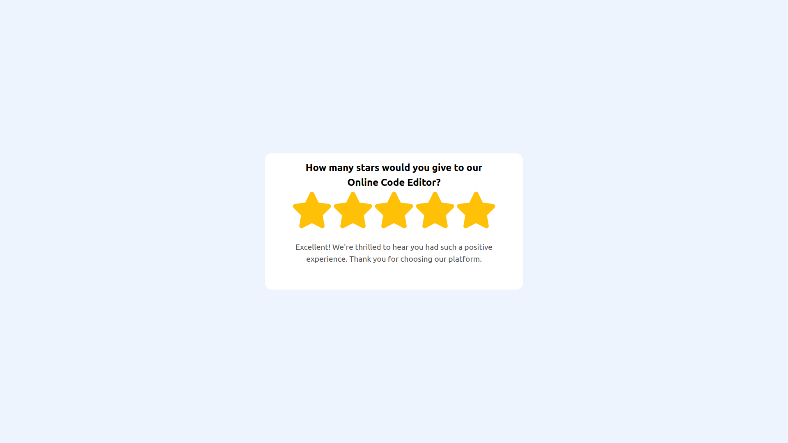

# Challange Title
Star Rating Component

## Challenge Description
In this frontend challenge, you'll build a Star Rating Component. This challenge is perfect for you if you're interested in building front-end web components and taking your front-end skills to the next level!

## Difficulty Level
Intermediate

## Tags
FRONTEND

## Learning
In this frontend challenge, you'll learn how to build a real-world UI component using JavaScript or ReactJs. You'll also learn how to use CSS Flexbox to lay out the component and make it responsive. This frontend challenge is a great opportunity to improve your JavaScript & ReactJs skills by building a frontend web component. You're going to love it!

## Requirements

- The Star Rating component should display a set of stars that can be clicked or hovered over to select a rating.
- The component should be customizable, with an option to change the number of stars to be displayed.
- When the user clicks on a star to select a rating, the rating should be updated, and a corresponding message should be displayed.
- The component should ensure that hovering over the third star after selecting the fourth star highlights only the first, second and third stars.

    **Bonus Requirements**

  - The component should allow users to select half-ratings (e.g., 4.5 stars).

## Screenshot

## Links
- Repository - [Github](https://github.com/bhaskrr/star-rating-component)
- Live site url - [Vercel](https://star-rating-component-opal.vercel.app/)

## Acknowledgements
- [This](https://www.youtube.com/watch?v=9sSBMF8K7sY) video helped me to complete this challange. Thanks to the creator.
## Remaining Work
- I could not implement the bonus challange.
